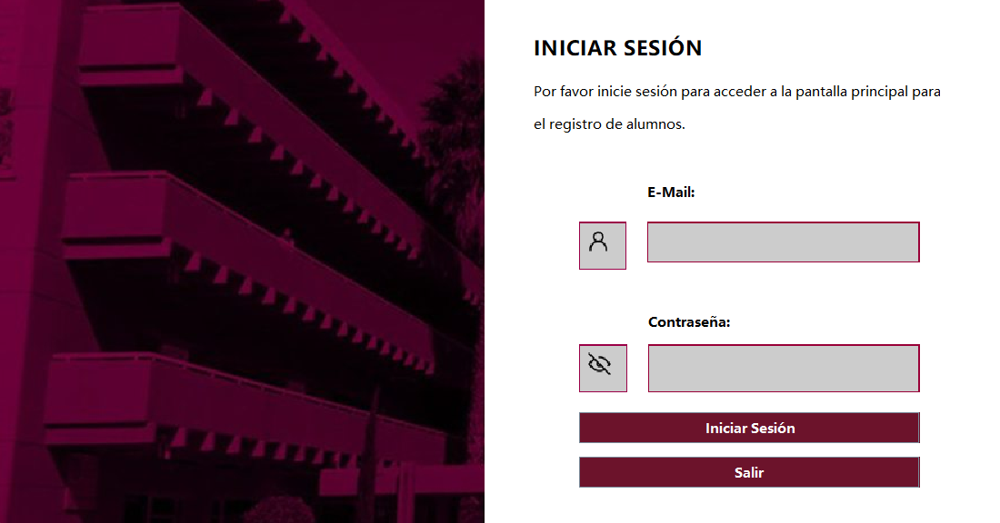
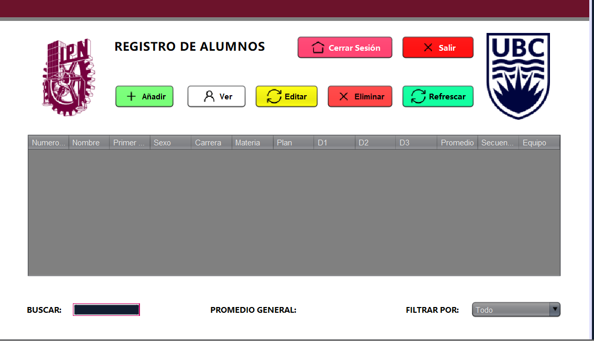
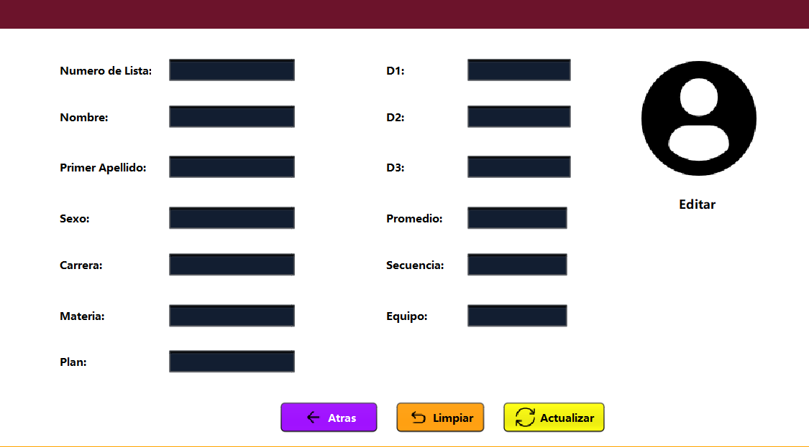
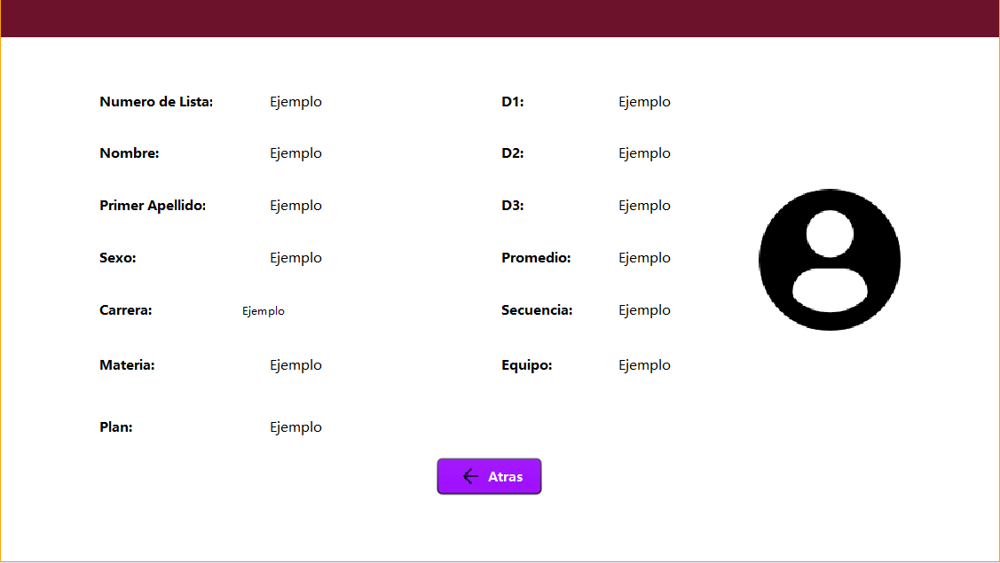

<h1 align="center">☕ JAVA CRUD Alumnos ☕</h1>

  Java CRUD for the registration, edition and delete of students of a school, this registration works with MySQL database. Using NetBeans

### Login
  

### Register
  

### Edit
    

### View
    

> This project was made for learning purposes only, Any errors that may be found must be corrected by yourself.

>>Database:
Name: dbcalificaciones,   `NumeroLista` int(11) NOT NULL,
  `Nombre` varchar(50) NOT NULL,
  `ApellidoPaterno` varchar(50) NOT NULL,
  `Sexo` varchar(15) NOT NULL,
  `Carrera` varchar(50) NOT NULL,
  `Materia` varchar(50) NOT NULL,
  `PlanEstudios` int(11) NOT NULL,
  `D1` int(11) NOT NULL,
  `D2` int(11) NOT NULL,
  `D3` int(11) NOT NULL,
  `PromedioR` int(11) NOT NULL,
  `Secuencia` varchar(20) NOT NULL,
  `NoEquipo` int(11) NOT NULL.

  and

>>`id` int(11) NOT NULL,
  `user` varchar(45) NOT NULL,
  `password` varchar(255) NOT NULL  

user: admin@root.com password: root

mysql connector for java is located in driver folder
# How to use
## Step 1⃣
* Import the project to your netbeans folder
## Step 2
* Open the project, check for errors and then compile and run.
## Step 3
* If you have already connected the database and everything works, you can compile the project to .jar

# Download
Available only for Windows.

[Check the latest release](https://github.com/alexa-00/espejito)

# Complete Documentation

[PDF](./DocCalificaciones.pdf)

# License
💜 [MIT License](/LICENSE)
